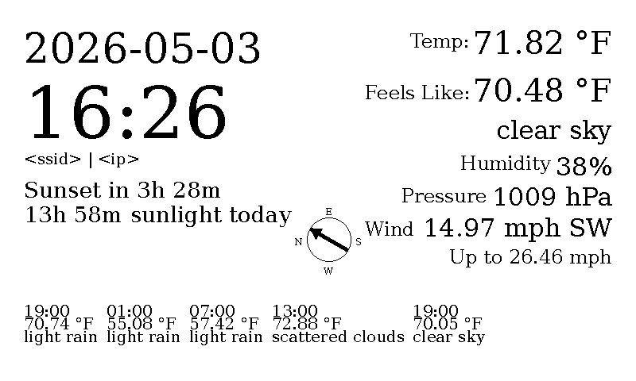

# epaper

An epaper display based on waveshare displays and a Raspberry Pi

- Current date and time
- Weather (temperature, conditions, wind, precipitation, 5-day forecast)
- Sunrise/sunset times
- Network info

## Images




## Requirements

- Raspberry Pi with a Waveshare e-paper display
- Python 3.10+
- An [OpenWeatherMap](https://openweathermap.org/api) API key

## Setup

1. Install dependencies:

   ```
   pip install -r requirements.txt
   ```

2. Add your OpenWeatherMap API key to `openweatherapikey.txt`.

3. Run once to preview (saves `output.bmp`):

   ```
   python run.py generate
   ```

4. Run continuously on the display:

   ```
   python run.py run
   ```

## Running as a systemd service

To install and enable the service so it starts on boot:

```
make install-systemd
```

## Development

```
make format   # Format code with black
make test     # Run tests
make typecheck  # Run mypy
```
